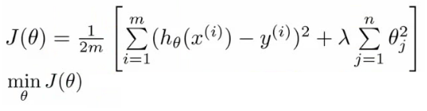

# Linear Regression

The model can be built in two different ways:

- Normal Equation
- Gradient Descent

## Normal Equation

Normal Equation is an analytical approach to Linear Regression with a Least Square Cost Function. We can directly find out the value of θ without using Gradient Descent. Following this approach is an effective and a time-saving option when are working with a dataset with small features (parameters).

It is calculated by:

In the above equation,

θ : hypothesis parameters that define it the best.
 
X : Input feature value of each instance.
 
Y : Output value of each instance.

## Gradient Descent

In this approach, we find the cost (error) and then try to minimize it at each iteration. 

We can have many features but the model uses a linear approach. We can use polynomial equation for higher order models. 

### Regularization

This is an optional parameter that we can use with cost functions to combat overfitting problem in machine learning datasets.

The cost function is modified as shown -

The extra parameter lambda ensures that the model does not overfit.